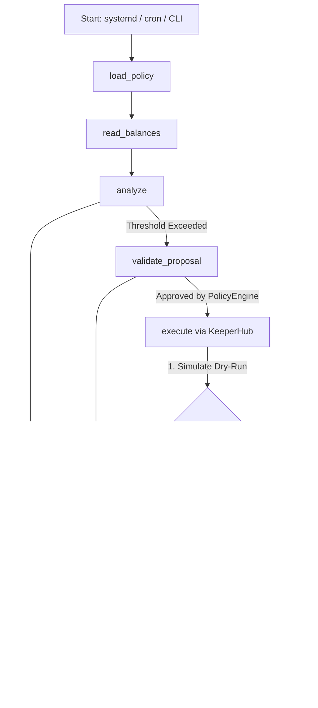
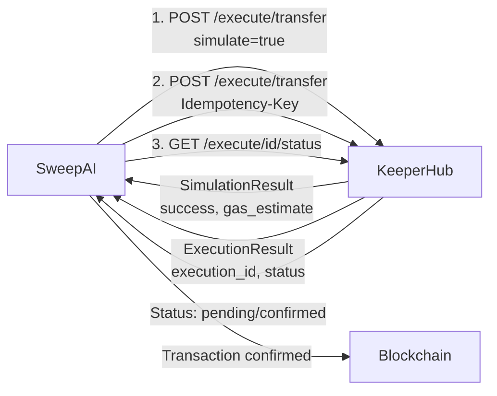

# SweepAI

> **Autonomous Treasury Management Agent for EVM-Compatible Blockchains**

[](https://www.python.org/)
[](https://opensource.org/licenses/MIT)
[](https://keeperhub.com)
[](#deployment)

[View Live Transaction on Etherscan](https://sepolia.etherscan.io/tx/0x660d98feba792d7b46556e96514408caae6648a7de6b21e0eb334ac95eefc68d)

---

## Verified On-Chain Proof

SweepAI is fully deployed and actively executing transfers on-chain via KeeperHub:

- **Live Deployment Target:** Sepolia Testnet (Chain ID: `11155111`)
- **Hot Wallet (Turnkey EOA):** [`0x7bceDf6258F774D605e1a7FFB95066126C5bD4e8`](https://sepolia.etherscan.io/address/0x7bceDf6258F774D605e1a7FFB95066126C5bD4e8)
- **Cold Vault Destination:** [`0x43363439C9140A8A5dE9BE6AF3FC0750be07cadb`](https://sepolia.etherscan.io/address/0x43363439C9140A8A5dE9BE6AF3FC0750be07cadb)
- **Executed Transaction Hash:** [`0x660d98feba792d7b46556e96514408caae6648a7de6b21e0eb334ac95eefc68d`](https://sepolia.etherscan.io/tx/0x660d98feba792d7b46556e96514408caae6648a7de6b21e0eb334ac95eefc68d)

---

## Overview

SweepAI is an autonomous treasury management agent that monitors hot wallet balances on EVM-compatible blockchains and executes sweep transactions to move excess funds into a secure vault. When a wallet's balance exceeds a configurable threshold, SweepAI calculates the optimal sweep amount, validates it against a deterministic policy engine, and submits the transaction via [KeeperHub](https://app.keeperhub.com) — all without manual intervention.

**Live in production** on Google Cloud Platform (E2-Micro VM), monitoring and sweeping funds on Sepolia testnet with 60-second polling intervals.

## Key Features

- **Autonomous Operation** — Runs as a systemd service with configurable polling intervals, requiring zero manual oversight
- **Deterministic Policy Engine** — Every sweep is validated against configurable thresholds, gas reserves, cooldown periods, and destination allowlists before execution
- **Simulation-First Execution** — Transactions are dry-run via KeeperHub before broadcasting, preventing failed transfers and wasted gas
- **Multi-Chain Support** — Ethereum, Sepolia, Base, Base Sepolia, Arbitrum, and Polygon out of the box, with configurable RPC endpoints per chain
- **Cooldown Enforcement** — Prevents excessive sweeping by enforcing minimum intervals between transactions
- **Complete Audit Trail** — Every proposal, execution, and outcome is persisted to SQLite for full traceability

## Architecture

SweepAI is built as a stateful **LangGraph** workflow that separates reasoning, policy enforcement, and execution into explicit, deterministic state transitions:



| Node | Responsibility |
|------|---------------|
| `load_policy` | Load configuration, check pause state, retrieve last sweep timestamp for cooldown |
| `read_balances` | Query blockchain RPC for current wallet balance (native or ERC-20) |
| `analyze` | Calculate sweep amount using the deterministic policy engine |
| `validate_proposal` | Enforce chain, destination, bounds, gas reserve, and cooldown rules |
| `execute` | Simulate transfer via KeeperHub, then execute and poll for confirmation |
| `audit` | Persist proposal and execution record to the audit database |

## How It Works

### Sweep Lifecycle

1. **Monitor** — The agent polls the hot wallet balance at a configurable interval (default: 60 seconds)
2. **Evaluate** — The policy engine compares the balance against the sweep threshold and calculates the excess
3. **Validate** — The proposal is checked against all policy rules: chain support, destination allowlist, amount bounds, gas reserve, and cooldown period
4. **Execute** — Approved proposals are simulated first, then submitted via KeeperHub's Direct Execution API
5. **Audit** — The full record — proposal, execution ID, transaction hash, and status — is persisted to SQLite

### KeeperHub Integration

SweepAI uses KeeperHub's **Direct Execution API** with a three-step process to ensure safe on-chain transfers:



| Step | Endpoint | Purpose |
|------|----------|---------|
| Simulate | `POST /execute/transfer` with `simulate: true` | Dry-run to verify the transfer would succeed |
| Execute | `POST /execute/transfer` with `Idempotency-Key` | Submit the actual on-chain transaction |
| Status | `GET /execute/{id}/status` | Poll until the transaction is confirmed or fails |

Idempotency keys are generated using SHA-256 hashing of normalized inputs (`task_id`, `chain_id`, `recipient`, `amount`, `token_address`) to prevent duplicate transactions on retries.

### Why KeeperHub is Essential

Moving treasury value on-chain autonomously is prone to failures from gas spikes, stuck transactions, and MEV frontrunning. SweepAI delegates execution to KeeperHub to gain:

- **Gas-Aware Simulation** — Prevents sending failing transactions by dry-running sweeps before broadcast
- **Deterministic Idempotency** — SHA-256 idempotency keys prevent double-sweeping on network retries
- **Reliable Execution Relaying** — Abstraction over RPC failures, transaction polling, and confirmation tracking

## Quick Start

```bash
# 1. Clone and enter the project
git clone https://github.com/mianohh/SweepAI.git && cd SweepAI

# 2. Create virtual environment and install
python3 -m venv venv && source venv/bin/activate
pip install -e ".[dev]"

# 3. Configure environment variables
cp .env.example .env
# Edit .env and set KEEPERHUB_API_KEY

# 4. Configure application settings
cp config/config.example.toml config/config.toml
# Edit config/config.toml with your wallet and policy settings

# 5. Verify everything works
sweepai doctor
sweepai observe
```

## Configuration Reference

### Environment Variables (`.env`)

| Variable | Required | Description |
|----------|----------|-------------|
| `KEEPERHUB_API_KEY` | Yes | KeeperHub API key (prefix `kh_`). Used for transaction simulation and execution |
| `RPC_URL_<chainId>` | No | Custom RPC endpoint for a specific chain. Overrides the built-in default |

### Application Config (`config/config.toml`)

#### `[treasury]` — Wallet Settings

| Parameter | Type | Description |
|-----------|------|-------------|
| `source_address` | `string` | The hot wallet address to monitor (EIP-55 checksummed) |
| `chain_id` | `string` | Numeric chain ID (e.g., `"11155111"` for Sepolia) |
| `token_address` | `string?` | ERC-20 token contract address. Omit for native ETH |

#### `[policy]` — Sweep Policy

| Parameter | Type | Default | Description |
|-----------|------|---------|-------------|
| `sweep_threshold` | `string` | — | Balance threshold that triggers a sweep (decimal string, e.g., `"0.23"`) |
| `min_sweep_amount` | `string` | — | Minimum amount per sweep transaction (prevents dust) |
| `max_sweep_amount` | `string` | — | Maximum single sweep transaction cap |
| `gas_reserve` | `string` | — | Amount retained in the wallet for gas fees |
| `cooldown_seconds` | `int` | `3600` | Minimum seconds between sweep transactions |
| `allowed_destinations` | `string[]` | — | Vault addresses authorized to receive sweeps |
| `chain_ids` | `string[]` | — | Supported chain IDs for this configuration |

#### `[keeperhub]` — API Endpoints

| Parameter | Type | Default | Description |
|-----------|------|---------|-------------|
| `mcp_endpoint` | `string` | `https://app.keeperhub.com/mcp` | KeeperHub MCP endpoint |
| `api_endpoint` | `string` | `https://app.keeperhub.com/api` | KeeperHub Direct Execution API |

#### `[database]` — Persistence

| Parameter | Type | Default | Description |
|-----------|------|---------|-------------|
| `path` | `string` | `data/sweepai.db` | SQLite database path for audit records |

## CLI Reference

| Command | Description |
|---------|-------------|
| `sweepai doctor` | Verify configuration, API key, and database connectivity |
| `sweepai observe` | Read and display the current wallet balance |
| `sweepai evaluate` | Run the analysis pipeline to determine if a sweep is needed |
| `sweepai propose` | Generate and store a sweep proposal in the database |
| `sweepai approve <id>` | Approve a pending proposal for execution |
| `sweepai execute <id>` | Execute an approved proposal via KeeperHub |
| `sweepai status <id>` | Check the status of an in-flight execution |
| `sweepai audit` | View the audit trail of proposals and executions |
| `sweepai pause` | Emergency pause all sweep operations |
| `sweepai unpause` | Resume operations after a pause |
| `sweepai cron --interval <s>` | Run as a continuous polling daemon (used by systemd) |

## Deployment

SweepAI is designed to run as a **systemd service** on a Linux VM. The included `deploy.sh` script handles initial setup on a fresh Google Cloud E2-Micro instance.

**Currently live** on Google Cloud (`sweepai-agent`, `us-central1-a`, E2-Micro) with 60-second polling, automatically sweeping ETH on Sepolia testnet.

> **Live Deployment Status:** SweepAI is actively running on a live Google Cloud VM (`e2-micro`), polling the Sepolia Turnkey EOA every 60 seconds via systemd daemon. Any deposit exceeding the configured threshold (`0.23 ETH`) is automatically swept to the cold vault in real-time.

### Initial Setup

```bash
# On the GCE VM
bash deploy.sh

# Configure credentials
cp .env.example .env
nano .env  # Set KEEPERHUB_API_KEY

# Configure sweep policy
cp config/config.example.toml config/config.toml
nano config/config.toml  # Set wallet address, threshold, destinations

# Verify
sweepai doctor
sweepai observe
```

### Systemd Service

```bash
# Install and enable the service
sudo cp sweepai.service /etc/systemd/system/
sudo systemctl daemon-reload
sudo systemctl enable sweepai
sudo systemctl start sweepai

# Check status
sudo systemctl status sweepai

# View logs
sudo journalctl -u sweepai -f
```

The service runs with `Restart=always` and a 10-second restart delay, ensuring the agent recovers automatically from failures.

### Updating

```bash
cd ~/SweepAI
git pull origin main
source venv/bin/activate
pip install -e . -q
sudo systemctl restart sweepai
```

### Current Production Deployment

| Detail | Value |
|--------|-------|
| Instance | `sweepai-agent` |
| Zone | `us-central1-a` |
| Machine Type | E2-Micro |
| Polling Interval | 60 seconds |
| Chain | Sepolia (11155111) |
| Service | `sweepai.service` (systemd, `Restart=always`) |

## Supported Chains

| Chain | Chain ID | Default RPC |
|-------|----------|-------------|
| Ethereum Mainnet | `1` | `https://eth.llamarpc.com` |
| Sepolia | `11155111` | Configurable via `RPC_URL_11155111` |
| Base | `8453` | `https://mainnet.base.org` |
| Base Sepolia | `84532` | `https://sepolia.base.org` |
| Arbitrum One | `42161` | `https://arb1.arbitrum.io/rpc` |
| Polygon | `137` | `https://polygon-rpc.com` |

Custom RPC endpoints can be set per chain using `RPC_URL_<chainId>` environment variables. This is recommended for production deployments to avoid rate limits on public endpoints.

## Development

```bash
# Install with dev dependencies
pip install -e ".[dev]"

# Lint
ruff check src/ tests/

# Type check
mypy src/

# Tests
pytest
```

## Project Structure

```
SweepAI/
├── config/
│   ├── config.example.toml       # Configuration template
│   ├── config.production.toml    # Production settings (GCE deployment)
│   ├── config.test.toml          # Test configuration
│   └── config.toml               # Active configuration (gitignored)
├── data/
│   └── sweepai.db                # SQLite audit trail (gitignored)
├── src/sweepai/
│   ├── adapters/
│   │   ├── balance.py            # Blockchain balance reader (JSON-RPC)
│   │   └── keeperhub.py          # KeeperHub execution adapter
│   ├── cli/
│   │   └── main.py               # Click CLI and cron daemon
│   ├── core/
│   │   ├── config.py             # TOML configuration loader
│   │   ├── database.py           # Async SQLite persistence layer
│   │   ├── logging.py            # Structured logging (JSON and human)
│   │   ├── models.py             # Data models and state machine
│   │   └── policy.py             # Deterministic policy engine
│   └── workflow/
│       ├── graph.py              # LangGraph workflow builder
│       └── nodes.py              # Workflow node implementations
├── tests/                        # pytest test suite
├── deploy.sh                     # GCE deployment script
├── sweepai.service               # systemd unit file
├── .env.example                  # Environment variable template
├── pyproject.toml                # Build config and dependencies
└── README.md
```

## Security

SweepAI is designed with several security layers to protect treasury funds:

- **Destination Allowlist** — Sweeps can only be sent to pre-approved vault addresses. The policy engine rejects any proposal targeting an address not in the `allowed_destinations` list.
- **Gas Reserve Enforcement** — The agent guarantees a minimum balance is retained in the hot wallet for gas, preventing the wallet from being drained below a safe minimum.
- **Cooldown Period** — A configurable minimum interval between sweeps prevents rapid or repeated draining.
- **Simulation-First** — Every transfer is dry-run via KeeperHub before execution, catching reverts and errors before they cost gas.
- **Emergency Pause** — The `sweepai pause` command immediately halts all operations. The pause state persists across restarts via the audit database.
- **Idempotent Execution** — SHA-256-based idempotency keys prevent duplicate transactions on retries.

## License

MIT
